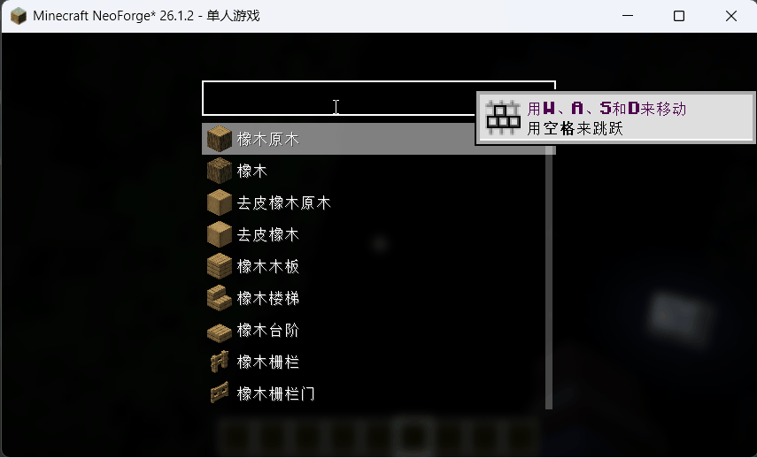

[中文](README_CN.md)

# Quick Take

A client-side NeoForge mod that adds a **Spotlight/Alfred-like quick item search** interface for Creative Mode. Quickly find and select any item by typing its name, registry ID, or tooltip text.

## Features

- **Instant item search** — Press `R` (configurable) to open a full-screen search overlay while in Creative Mode
- **Smart subsequence matching** — Type `dia pic` to find "Diamond Pickaxe"; search matches display names, registry IDs, and tooltips
- **Three-phase async search** — Results appear in real-time: display name matches first, then registry IDs, then tooltips
- **Auto-hotbar placement** — Selected items are intelligently placed into your hotbar (reuses existing stacks, swaps if needed)
- **Typing shortcut** — Start typing any character while the Creative Inventory screen is open to automatically open the search pre-filled with that character
- **Pinyin support** — Optional integration with [Just Enough Characters](https://www.curseforge.com/minecraft/mc-mods/just-enough-characters) for Chinese pinyin input matching

## Usage

1. **Press R** anywhere in Creative Mode to open the search overlay
2. Type part of an item's name, registry ID, or tooltip — results filter in real-time
3. Use arrow keys (↑↓) to navigate, press Enter to select, or click an item
4. Scroll with mouse wheel to see more results
5. Press Esc to close without selecting

## Keybindings

| Key | Default | Description |
|-----|---------|-------------|
| Open Quick Take | R | Opens the search overlay (Creative Mode only) |

## Disclaimer

This mod is entirely generated by **DeepSeek V4 Pro** (AI). The author has performed minimal to no reliable review of the code. Please carefully inspect the code before use. Use at your own risk.

## License

MIT